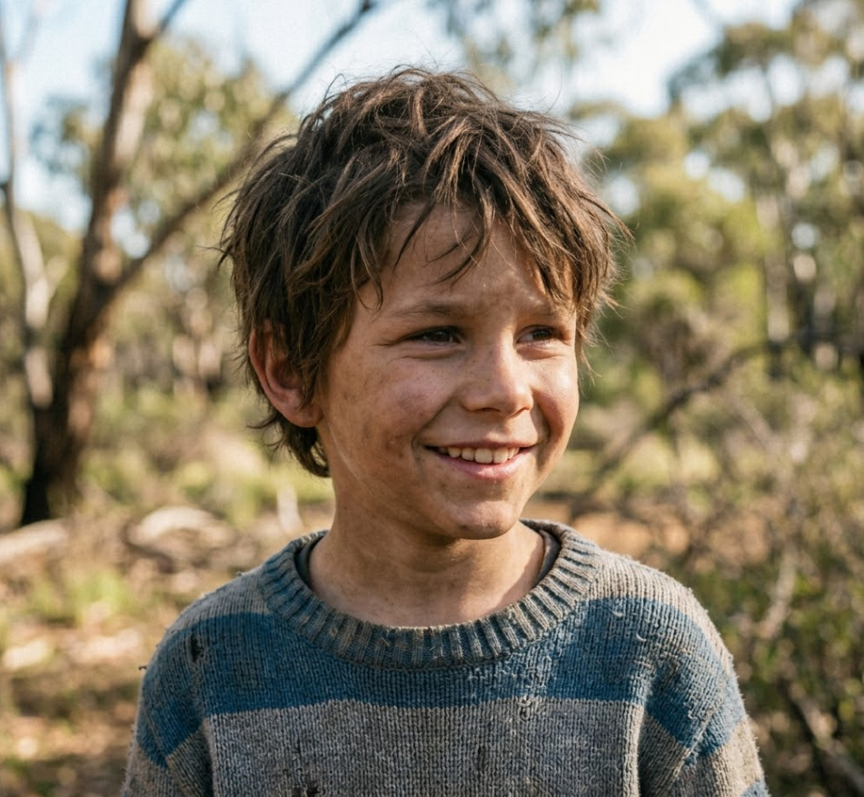
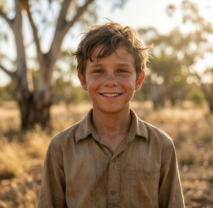
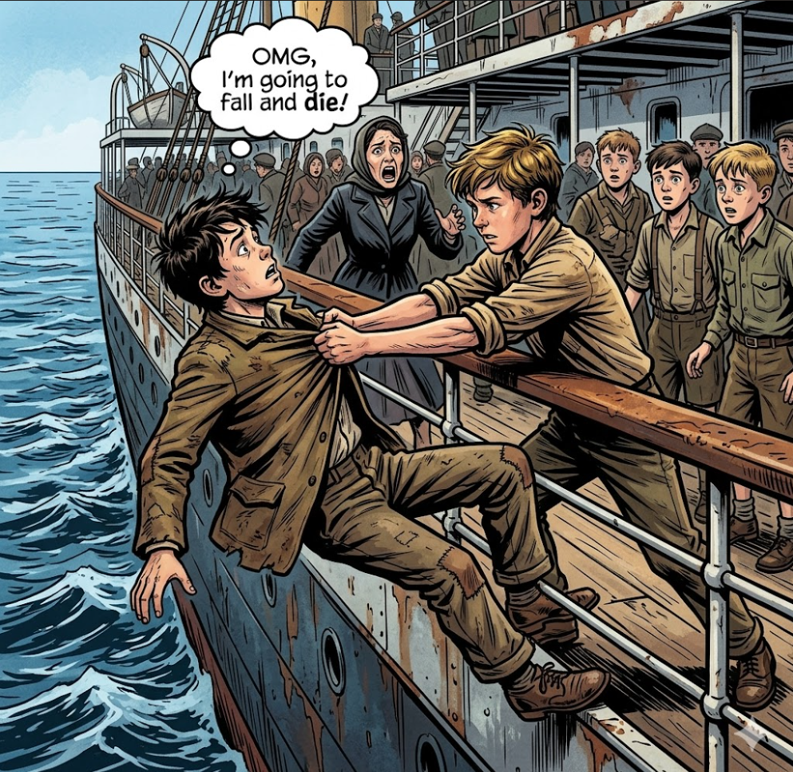

# AI Usage for Reader´s Log
All AI´s used during the creation of my Reader´s Log
including all used Prompts

## Chapter 1
Images for WhatsApp Chat were made by Gemini nano Bannana using the following Prompts:
### Image 1
 
Prompt: "Make an whatsapp profile image of Dibs. The character in the book "A Prayer for Blue Delaney". He looks happy. Its his profile picture"

### Image 2
 
Prompt: "Create a WhatsApp profile picture of Colm McCabe, the 10-year-old protagonist from the book 'A Prayer for Blue Delaney'. 

Character Details:
- Age/Appearance: A 10-year-old boy with a lean, resilient build, sun-browned skin, and messy, windblown brown hair.
- Expression: A genuine, happy, and hopeful smile, showing a sense of freedom.
- Clothing: Simple, slightly worn 1950s-era Australian working clothes, like a plain blue or earth-toned cotton shirt.
- Setting: The background should show the sunny, dusty Australian outback with soft-focus eucalyptus trees and dry grass, capturing the atmosphere of his journey.

Style and Composition:
- A close-up portrait focusing on his face and shoulders.
- Cinematic, realistic photography with warm, natural sunlight.
- The background should have a soft blur (bokeh effect) to keep the focus entirely on the character.
- No text, watermarks, or overlay graphics."

#### Note that this Prompt was made by Gemini using the folowing Prompts: 
- "Make an profile picture of Calm from the book "A Prayer for Blue Delaney". He is happy"
- "No. Check the book."
- "please create a Prompt for yourselve"

### Grammar
Prompt: "Is all grammatic alright?" + an screenshot of the Chatroom

answere: "There are a few typos and small grammar mistakes in image_ed96e8.png. Since this is a WhatsApp chat between ten-year-old boys, some informal grammar (like "I got a mum" or "Me not so much") actually fits perfectly. However, the spelling mistakes should be fixed for a school assignment. Here are the specific corrections: 
- Spelling & Typo FixesAustrailia $\rightarrow$ Australia (Message 1)
- dont wand $\rightarrow$ don't want (Messages 1, 5, 14)
- Maby $\rightarrow$ Maybe (Message 3)
- familiy $\rightarrow$ family (Message 3)
- belive $\rightarrow$ believe (Message 14)
- borring $\rightarrow$ boring (Message 14)
- I thing $\rightarrow$ I think (Message 16)
- friends to play with $\rightarrow$ friends to play with (Remove the comma before "we'll" in Message 16: "And I think we'll meet...")
- awsome $\rightarrow$ awesome (Message 17)
---
Punctuation & Grammar Tweak 
- In the first message: "Sister Clothilde said, that I´m..." $\rightarrow$ Remove the comma before "that" ("Sister Clothilde said that I'm..."). In English, you don't separate "said that" with a comma.
- Make sure your apostrophes are consistent. You used a backtick/accent ´ in some messages (I´m, we´ll, I´m still sceptical) and omitted them in others (dont, Im, cant). Using standard straight apostrophes ' (I'm, don't, we'll) looks much cleaner."

   
## Chapter 2
The Image was made by gemini. The startup promt was as following: "refine this promt a bit. Not too much dough: "Create a picture of an scene from "A Prayer for Blue Delaney". It should be a boy named tommy. he is Irish and 13 yo. He is climing o the rail of an cruse ship. Its is a ship used to tranzport the kids from orpangeges to austrailia. The Boy tommy then exendantly loases controll and almost falls of the ship, but Calm, who is in the picture provided, saves him, by grabbing his t-Shirt an resquing him. Add thought bubbles. Tommy things "omg i´m going to fall and die" and colm things "I have tr resque him. Why is nobody else doing it?". In the background there is a woman screeming, and is scared for her life. Tommys friends, are also irish and aboute 13. They are also scarred, but they dont try to resque them. To resque Tommmy, colm had to push aside the people a bit, to get to tommy." Give me a better promt. Do not create an image. Also note that the Image is also purly Ai. Not a real person"

---

Gemini created this promt: "A dramatic comic-book-style scene from the book "A Prayer for Blue Delaney". 

Characters:
- Tommy: A 13-year-old Irish boy, looking terrified. He is slipping off the high railing of a large, old transport ship.
- Colm: (Matching the provided reference image. The Image is also purly Ai. Not a real person), acting quickly, firmly grabbing Tommy by his shirt to pull him back to safety.
- Background Crowd: A woman in the background is screaming in terror. A small group of Tommy's friends (13-year-old Irish boys) stand frozen, looking shocked and scared but not moving to help. You can see space cleared around Colm where he had to push past people to reach Tommy.

Setting: 
The deck of a 1950s-era ocean liner/transport ship carrying orphanage children to Australia. The atmosphere is tense and chaotic.

Text Elements (Comic Style Thought Bubbles):
- A thought bubble from Tommy: "OMG, I'm going to fall and die!"
- A thought bubble from Colm: "I have to rescue him! Why is nobody else doing it?""
---

The provided Image for Colm, is:

 

---

The resulting Image is:  
 