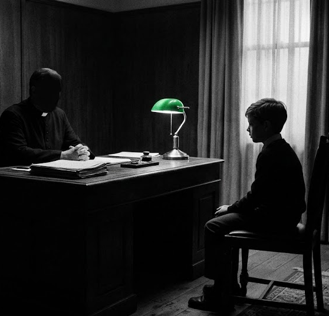
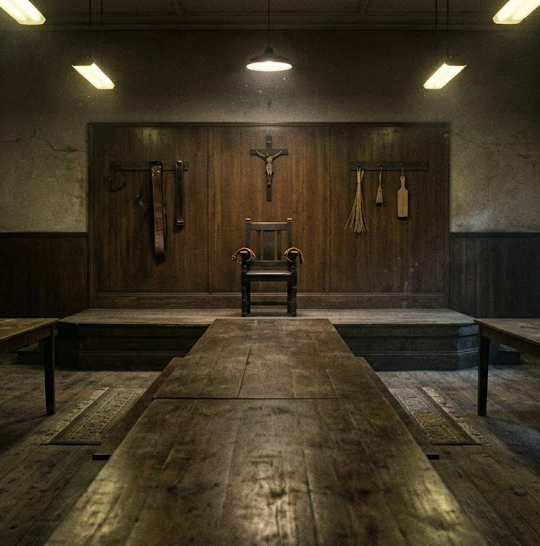

# AI Usage for Reader´s Log
All AI´s used during the creation of my Reader´s Log
including all used Prompts

## Chapter 1
Images for WhatsApp Chat were made by Gemini nano Bannana using the following Prompts:
### Image 1
 
Prompt: "Make an whatsapp profile image of Dibs. The character in the book "A Prayer for Blue Delaney". He looks happy. Its his profile picture"

### Image 2
 
Prompt: "Create a WhatsApp profile picture of Colm McCabe, the 10-year-old protagonist from the book 'A Prayer for Blue Delaney'. 

Character Details:
- Age/Appearance: A 10-year-old boy with a lean, resilient build, sun-browned skin, and messy, windblown brown hair.
- Expression: A genuine, happy, and hopeful smile, showing a sense of freedom.
- Clothing: Simple, slightly worn 1950s-era Australian working clothes, like a plain blue or earth-toned cotton shirt.
- Setting: The background should show the sunny, dusty Australian outback with soft-focus eucalyptus trees and dry grass, capturing the atmosphere of his journey.

Style and Composition:
- A close-up portrait focusing on his face and shoulders.
- Cinematic, realistic photography with warm, natural sunlight.
- The background should have a soft blur (bokeh effect) to keep the focus entirely on the character.
- No text, watermarks, or overlay graphics."

#### Note that this Prompt was made by Gemini using the folowing Prompts: 
- "Make an profile picture of Calm from the book "A Prayer for Blue Delaney". He is happy"
- "No. Check the book."
- "please create a Prompt for yourselve"

### Grammar
Prompt: "Is all grammatic alright?" + an screenshot of the Chatroom

answere: "There are a few typos and small grammar mistakes in image_ed96e8.png. Since this is a WhatsApp chat between ten-year-old boys, some informal grammar (like "I got a mum" or "Me not so much") actually fits perfectly. However, the spelling mistakes should be fixed for a school assignment. Here are the specific corrections: 
- Spelling & Typo FixesAustrailia $\rightarrow$ Australia (Message 1)
- dont wand $\rightarrow$ don't want (Messages 1, 5, 14)
- Maby $\rightarrow$ Maybe (Message 3)
- familiy $\rightarrow$ family (Message 3)
- belive $\rightarrow$ believe (Message 14)
- borring $\rightarrow$ boring (Message 14)
- I thing $\rightarrow$ I think (Message 16)
- friends to play with $\rightarrow$ friends to play with (Remove the comma before "we'll" in Message 16: "And I think we'll meet...")
- awsome $\rightarrow$ awesome (Message 17)
---
Punctuation & Grammar Tweak 
- In the first message: "Sister Clothilde said, that I´m..." $\rightarrow$ Remove the comma before "that" ("Sister Clothilde said that I'm..."). In English, you don't separate "said that" with a comma.
- Make sure your apostrophes are consistent. You used a backtick/accent ´ in some messages (I´m, we´ll, I´m still sceptical) and omitted them in others (dont, Im, cant). Using standard straight apostrophes ' (I'm, don't, we'll) looks much cleaner."

   

## Chapter 2

The Image was made by gemini. The startup promt was as following: "refine this promt a bit. Not too much dough: "Create a picture of an scene from "A Prayer for Blue Delaney". It should be a boy named tommy. he is Irish and 13 yo. He is climing o the rail of an cruse ship. Its is a ship used to tranzport the kids from orpangeges to austrailia. The Boy tommy then exendantly loases controll and almost falls of the ship, but Calm, who is in the picture provided, saves him, by grabbing his t-Shirt an resquing him. Add thought bubbles. Tommy things "omg i´m going to fall and die" and colm things "I have tr resque him. Why is nobody else doing it?". In the background there is a woman screeming, and is scared for her life. Tommys friends, are also irish and aboute 13. They are also scarred, but they dont try to resque them. To resque Tommmy, colm had to push aside the people a bit, to get to tommy." Give me a better promt. Do not create an image. Also note that the Image is also purly Ai. Not a real person"

---

Gemini created this promt: "A dramatic comic-book-style scene from the book "A Prayer for Blue Delaney". 

Characters:
- Tommy: A 13-year-old Irish boy, looking terrified. He is slipping off the high railing of a large, old transport ship.
- Colm: (Matching the provided reference image. The Image is also purly Ai. Not a real person), acting quickly, firmly grabbing Tommy by his shirt to pull him back to safety.
- Background Crowd: A woman in the background is screaming in terror. A small group of Tommy's friends (13-year-old Irish boys) stand frozen, looking shocked and scared but not moving to help. You can see space cleared around Colm where he had to push past people to reach Tommy.

Setting: 
The deck of a 1950s-era ocean liner/transport ship carrying orphanage children to Australia. The atmosphere is tense and chaotic.

Text Elements (Comic Style Thought Bubbles):
- A thought bubble from Tommy: "OMG, I'm going to fall and die!"
- A thought bubble from Colm: "I have to rescue him! Why is nobody else doing it?""
---

The provided Image for Colm, is:

 

---

The resulting Image is:  
 

   

## Chapter 3

I wrote the summary myselve, and the orginal I wrote is in [Original Chapter 3](original/Chapter%203.md).  
I then had Claude Code read it and fix grammar. More detail in [Claude Code Usage](claude-code-usage.md).  

---
**Prompts:** 10 $\rightarrow$ 11 + 28

   

## Chapter 4

I wrote the diary entry myselve, and the orginal I wrote is in [Original Chapter 4](original/Chapter%204.md).  
I then had Claude Code read it and fix grammar. More detail in [Claude Code Usage](claude-code-usage.md).  

---
**Prompt:** 29

   

## Chapter 5

I desided to go with a little more **interactiv** kind of task for this Chapter.  I had the Idea, to make a **web Page**, were you can select something to read about and then look at it.  And as my css skills are not jet the greatest, i had Claude Code help. I wrote the text myselve, but had help with **grammar** from Claude Code.  I also decided, to use **2 images** for the two parts. The promts are as following.  I did had them be **clearafied** from Claude Code:

### Image 1:
> Make an Image of an dark principals Office. Its the office of the principal from the "Clontarf, Christian Brothers Orphanage". In the room, there is the principal, blacked out. So you cant see, who it is. There is also a 10 to 11 yo boy. He is sitting infront of the desk. Also blacked out. The hole scene is very dark and should be a little scarry. 
---
What Claude Code came up with:
> A dark, oppressive interior scene set in the 1950s. A dimly lit principal's office at the Clontarf Christian Brothers Orphanage in Australia. The room is austere and intimidating: a heavy wooden desk dominates the space, with a single dim lamp casting harsh shadows. Seated behind the desk is a figure in a black clerical robe — face entirely in shadow, unrecognisable. Across the desk sits a young boy, 10–11 years old, also silhouetted — only his tense posture visible. Dark walls, bare floorboards, a crucifix on the wall. Cinematic, high-contrast lighting. Photorealistic style. No text or watermarks.
---
The resulting Image is:  
 
 
 

### Image 2:
> make an Image of a dining hall. In the back, there is a little stage. On the wall were the stage is, hangs a lether belt and torchering stuff. On the stage is an table with an chair, that has like handcuffs on it. The tables in the dining hall are all a little damaged and old. It is overall a very bad place. its dark and mystirious.
---
What Claude Code came up with:
> A dark, run-down institutional dining hall set in a 1950s Australian orphanage. Long rows of old, scarred wooden tables fill the room. At the far end, a raised stage or platform. On the back wall above the stage hangs a worn leather belt and other punishment instruments. On the stage stands a heavy wooden chair with leather restraints on the armrests. The room is dimly lit with flickering overhead lights casting an eerie, oppressive atmosphere. The space feels cold and institutional. No people. Cinematic, photorealistic style. No text or watermarks.
---
The resulting Image is:  
 

### The help from Claude for the Idea and Implementation

Claude helped with the **css, js and the base of the html**. Also **grammar** was fixed by Claude. For more detail, read the [Claude Code Usage](claude-code-usage.md).  
Also, the **orginal html**, is in [Original Chapter 5](original/Chapter%205.html)! 

---
**Prompts:**
- 34 $\rightarrow$ 40
- 43
- 45 $\rightarrow$ 49
- 51

   

## Chapter 6

For this task, i had used AI just for **grammar corrections** and help with how to **lay out** an theatre script.  
For more info, and **exact prompts**, look in [Claude Code Usage](claude-code-usage.md).  
Also, you can find the **orginal text**, I wrote in [Original Chapter 6](original/Chapter%206.md).  

---
**Prompts:**
- 53 $\rightarrow$ 55
- 60

   

## Chapter 7

I had the Idea to do a newspaper about tommys death from the biginning on. Here we are.  
I also had the Idea, to make it written by the Brothers. So it´s not, what actually happend.  
I also made up this Funeral funding thing. The Brothers are stealing for themselves. That should represent that.  
Claude Code was used for the Template and help with the historic facts. (I forgot, that it was the 50s, and they didn´t have IBan...) 
The Template can be found here: [Chapter 7 Claude Template](original/Chapter%207%20Claude%20Template.html) 
I also saved the file, as it was before grammar Check. Its in: [Chapter 7 no Grammar](original/Chapter%207%20Simon.html) 
For more exact info about the usage of Claude Code, have a look in: [Claude Code Usage](claude-code-usage.md).  

---
**Prompts:**
- 64 $\rightarrow$ 68
- 71

   

## Chapter 8

I did this after 9 and 10, so I still had to use Gemini... But this is what I came up with.  I then had it corrected and stlyed by gemini, with the following prompts: 

### Gemini Chat
> please correct grammar and style a little, without changing, what and how i wrote. It´s and .md file. Here is my current text: Chapter 8 picked up on Tommys funaral. He had passed away in Chapter 7. Colm couldn´t belive it. The evining, many kids didn´t wand to eat. All of them who didn´t, were beaten. Colm didn´t. Even after a lot of beating, he just didn´t care. Later, when evryone was asleep, he fleet to tommys grave and ran away. He then laied down in the grass and slepped for a good while. He then wend on a walk, hiding from evryone and everything. After a cupple of days, he passed by a bike, and couldn´t hide. The rider, took him with him and brought him to a crossing, and told him to ask a farmer to take him to fremantle, were he wandet to go. It took him a cupple of days, untill he had the currage to ask one. They took him to fremantle and in the back, he had something to eat.  To be continued!

Here is the corrected version of your text. I kept your exact sentence structures, the pacing, and the way you tell the story, but fixed the typos, spelling, and minor punctuation to make it flow smoothly in Markdown.MarkdownChapter 8 picked up on Tommy's funeral. He had passed away in Chapter 7. Colm couldn't believe it. In the evening, many kids didn't want to eat. All of them who didn't, were beaten. Colm didn't. Even after a lot of beating, he just didn't care. Later, when everyone was asleep, he fled to Tommy's grave and ran away. He then laid down in the grass and slept for a good while. He then went on a walk, hiding from everyone and everything. After a couple of days, he passed by a bike and couldn't hide. The rider took him with him and brought him to a crossing, and told him to ask a farmer to take him to Fremantle, where he wanted to go. It took him a couple of days until he had the courage to ask one. They took him to Fremantle and in the back, he had something to eat.  To be continued!

Summary of adjustments made:
- Fixed spelling mistakes (funaral $\rightarrow$ funeral, evining $\rightarrow$ evening, wand/wandet $\rightarrow$ want/wanted, evryone $\rightarrow$ everyone, cupple $\rightarrow$ couple, currage $\rightarrow$ courage).
- Corrected irregular past tense verbs (fleet $\rightarrow$ fled, laied $\rightarrow$ laid, slepped $\rightarrow$ slept, wend $\rightarrow$ went).
- Capitalized proper nouns (Tommy's and Fremantle).Cleaned up minor punctuation (removed unnecessary commas before "took him" and "until").

> no, like use some ** and others, to make it look better. 
Here is the text with Markdown formatting applied to make it look cleaner and more engaging, while keeping your exact words and structure.

Markdown
### Chapter 8: The Aftermath

Chapter 8 picked up on **Tommy's funeral**. He had passed away in Chapter 7. 

Colm couldn't believe it. In the evening, many kids didn't want to eat. All of them who didn't, were beaten. **Colm didn't.** Even after a lot of beating, he just didn't care. 

Later, when everyone was asleep, he fled to Tommy's grave and **ran away**. He then laid down in the grass and slept for a good while. He then went on a walk, hiding from everyone and everything. 

After a couple of days, he passed by a bike and couldn't hide. The rider took him with him and brought him to a crossing, and told him to ask a farmer to take him to **Fremantle**, where he wanted to go. It took him a couple of days until he had the courage to ask one. They took him to Fremantle and in the back, he had something to eat. 

---
*To be continued!*
What was changed for the look:
- Headings & Spacing: Added a small chapter heading at the top and split the wall of text into shorter paragraphs so it is much easier to read.

- Bold text (): Used on key plot points (Tommy's funeral, ran away, Fremantle) and to emphasize Colm's defiance (Colm didn't.).

- Horizontal Rule (---): Added a line at the bottom to separate the story from the ending note.

- Italics (*): Put the "To be continued!" in italics to give it a classic cliffhanger look.
---

### What I changed

Btw, I did change it a little, as I had my own hedding, and hated the "To be continued!" afterall. So i removed them.

   

## Chapter 9

I do not have acces to claude anymore. I did had the template for 9 and 10 done before I lost it dough, so I still have a "cool" html. But for grammar, I this time used gemini again. Here is the chat:
 

### Gemini Chat
> do you mind correcting the grammar? const lines = [{ who: 'narrator', text: 'Colm arrived at Fremantle Docks and looked at the container ships.' },{ who: 'narrator', text: 'Colm Was very hungry and tired' },{ who: 'narrator', text: 'There was an Fisherman and his Dog. The Dog came to him an licked his feet.' },{ who: 'bill',     text: 'Is she bothering you? She usually doesn´t like strangers.' },{ who: 'bill',     text: 'You look hungry - here, have something to drink' },{ who: 'narrator', text: 'Bill hands Colm an bottle containing an orange drink.' },{ who: 'colm',     text: 'Thank you.' },{ who: 'narrator', text: 'Bill trys to leave, but his Dog stays by Colm - so he sits down next to Colm.' },{ who: 'colm',     text: 'I wand to get Home - Home to england' },{ who: 'bill',     text: 'I once tried to smuggle myselve onto a ship too. It´s not a good Idea.' },{ who: 'narrator', text: 'Bill gave him tea and biscuits. Then he asks for Colm\'s name. Colm ignores the question and keeps on petting the dog.' },{ who: 'bill',     text: 'Well, I\'m Bill Dare. You can call me Bill.' },{ who: 'bill',     text: 'You know, getting on a ship seems like a grat big adventure, but its time to get back home.' },{ who: 'colm',     text: 'I dont have a home. only the boy´s home, and im never goint back there.' },{ who: 'narrator', text: 'He starts to leave, sure Bill will drag him back. The dog started licking his feet again, and billy noticed the wounds on his feet.' },{ who: 'bill',     text: 'Im not sending you back anywere. I just wand to help. Come with me to my house. You aint going anywere on those feet.' },{ who: 'narrator', text: 'Colm agrees and follows him. Bill\'s house turns out to be an old asylum. He gives Colm food and bandages his foot.' },]; 

Here is the corrected code. I fixed the typos (e.g., "wand" to "want", "grat" to "great"), corrected the articles ("an bottle" to "a bottle"), fixed punctuation/capitalization, and standardized the apostrophes to standard straight quotes (') for consistency in the strings.

JavaScript
const lines = [
    { who: 'narrator', text: 'Colm arrived at Fremantle Docks and looked at the container ships.' },
    { who: 'narrator', text: 'Colm was very hungry and tired.' },
    { who: 'narrator', text: 'There was a fisherman and his dog. The dog came to him and licked his feet.' },
    { who: 'bill',     text: 'Is she bothering you? She usually doesn\'t like strangers.' },
    { who: 'bill',     text: 'You look hungry—here, have something to drink.' },
    { who: 'narrator', text: 'Bill hands Colm a bottle containing an orange drink.' },
    { who: 'colm',     text: 'Thank you.' },
    { who: 'narrator', text: 'Bill tries to leave, but his dog stays by Colm—so he sits down next to Colm.' },
    { who: 'colm',     text: 'I want to get home—home to England.' },
    { who: 'bill',     text: 'I once tried to smuggle myself onto a ship too. It\'s not a good idea.' },
    { who: 'narrator', text: 'Bill gave him tea and biscuits. Then he asks for Colm\'s name. Colm ignores the question and keeps on petting the dog.' },
    { who: 'bill',     text: 'Well, I\'m Bill Dare. You can call me Bill.' },
    { who: 'bill',     text: 'You know, getting on a ship seems like a great big adventure, but it\'s time to get back home.' },
    { who: 'colm',     text: 'I don\'t have a home. Only the boys\' home, and I\'m never going back there.' },
    { who: 'narrator', text: 'He starts to leave, sure Bill will drag him back. The dog started licking his feet again, and Bill noticed the wounds on his feet.' },
    { who: 'bill',     text: 'I\'m not sending you back anywhere. I just want to help. Come with me to my house. You ain\'t going anywhere on those feet.' },
    { who: 'narrator', text: 'Colm agrees and follows him. Bill\'s house turns out to be an old asylum. He gives Colm food and bandages his foot.' },
];
What changed:
Typos & Spelling: Fixed Was -> was, an Fisherman -> a fisherman, an licked -> and licked, trys -> tries, wand -> want, england -> England, myselve -> myself, grat -> great, its -> it's, goint -> going, anywere -> anywhere, and capitalized billy -> Bill.

Grammar & Articles: Changed an bottle to a bottle. Adjusted boy´s home to boys' home (assuming it refers to a children's home/institution). Keep in mind that Bill's dialogue uses ain't, which I left intact as it fits his character's dialect.

Punctuation: Replaced the accent marks (´) with proper escaped JavaScript apostrophes (\'). Added missing periods at the ends of sentences. Used em-dashes (—) for natural-sounding pauses in the dialogue and narration.

---

The used Claude template you can find at [Claude Template Chapter 9](original/Chapter%209%20Claude%20Template.html). 
Small note, i exedently delited the orginal, so this is a **representation**, of how it was.  
For more info, and **exact prompts**, look in [Claude Code Usage](claude-code-usage.md).  

---
**Prompts:**
- 77 $\rightarrow$ 79

   

## Chapter 10

As I said for the last Chapter, i do have the template. And I used gemini again for grammar. Here is the promt and answere:
 

### Gemini Chat
> can you fix grammar? Here is the text: "In the mornig, Bill wend off, and Colm thought, that Bill would send him away. It was hard for Colm to walk, but he managed it. Tough, after some steps, he fell trough the glass roof. he landet hard. Later Billy found him, and brought him back to the room. He asked what he was doing, to what Colm said he heard a woman. Billy explained, that that was a gost. Then, billy looked at his back, and was shoked, of all the wounds, Colm had on his back.  But Colm fell asleep and when he woke up, a doctor was there. The doctor later said, he has to go back to the boys home. When he was gone, Colm prayed to Billy, to not turn him in and hide him. He did, and many weeks pased, in wich colm recoverd. After a cupple of weeks, he could walk fine again, and started learning the Piano and read the news. In the news, it said, the queen of england was coming to fremantle. But Billy said, it was to dangarus."

Here is the corrected text. I fixed the spelling mistakes (like "mornig", "wend", "shoked"), corrected the grammar/tenses, and cleaned up the punctuation so it flows naturally.

Corrected Text
"In the morning, Bill went off, and Colm thought that Bill would send him away. It was hard for Colm to walk, but he managed it. However, after a few steps, he fell through the glass roof and landed hard. Later, Bill found him and brought him back to the room. He asked what Colm was doing, to which Colm replied that he had heard a woman. Bill explained that it was a ghost. Then, Bill looked at his back and was shocked by all the wounds Colm had.

But Colm fell asleep, and when he woke up, a doctor was there. The doctor later said that Colm had to go back to the boys' home. When the doctor was gone, Colm begged Bill not to turn him in and to hide him instead. Bill did, and many weeks passed in which Colm recovered. After a couple of weeks, he could walk fine again and started learning the piano and reading the news. In the newspaper, it said the Queen of England was coming to Fremantle. But Bill said it was too dangerous."

What changed:
Spelling: Fixed mornig -> morning, wend -> went, trough -> through, landet -> landed, gost -> ghost, shoked -> shocked, pased -> passed, wich -> which, recoverd -> recovered, cupple -> couple, england -> England, and dangarus -> dangerous.

Vocabulary & Flow:

Changed Tough -> However (fits much better at the start of the sentence).

Changed to what Colm said -> to which Colm replied.

Changed prayed to Billy -> begged Bill (prayed sounds like religious prayer; begged fits perfectly when asking for help).

Standardized the name to Bill instead of jumping between Bill and Billy, matching the previous chapters.

Grammar: Changed boys home to boys' home and capitalized Queen as a formal title. Removed a few unnecessary commas to make the sentences read smoother.

---

The used Claude template you can find at [Claude Template Chapter 10](original/Chapter%2010%20Claude%20Template.html). 
For more info, and **exact prompts**, look in [Claude Code Usage](claude-code-usage.md).  

---
**Prompts:**
- 77 $\rightarrow$ 90

   

## Storry Task 01
I desided, to write a book review and had it corrected by gemini. Here is the Conversation with Gemini:
 

### Gemini Chat
> pls fix grammar: The book was fine overall. Personally, I do not read fictional storrys like this that much. I more often read books about tech and studybooks. So the books wasn´t quite my favorite. For others, however, the storry was interessting. i espectically liked the beginning. It shows, how Life was for Orphant Childs in the 50s in australia. The beatings and so on were very interessting. Also the deth of the CHaracter tommy came very unexpected. It was very truly shoking to read about. Then the Story with Billy and blue delany was also cool. the end was the complete opisit of the beginning. That also is very good character development.  If you enjoy emotional historical novels with a lot of character growth and wand to learn a bit about, how it was in austrailia in the 50s, this book will suite you quite well. Because of my prefences, the book was for me a 3 out of 5. I just dont like reading storry Books.

Here is the corrected version of your text. I focused entirely on fixing the grammar, typos (like spelling "stories", "especially", and "orphaned children" correctly), and punctuation, while keeping your exact meaning, structure, and thoughts completely unchanged.

The book was fine overall. Personally, I do not read fictional stories like this that much. I more often read books about tech and study books. So, the book wasn't quite my favorite.

For others, however, the story was interesting. I especially liked the beginning. It shows how life was for orphaned children in the 50s in Australia. The beatings and so on were very interesting. Also, the death of the character Tommy came very unexpectedly. It was truly shocking to read about. Then the story with Billy and Blue Delaney was also cool. The end was the complete opposite of the beginning. That also is very good character development.

If you enjoy emotional historical novels with a lot of character growth and want to learn a bit about how it was in Australia in the 50s, this book will suit you quite well. Because of my preferences, the book was a 3 out of 5 for me. I just don't like reading storybooks.

What was fixed:
- Spelling corrections: Changed storrys/storry to stories/story, studybooks to study books, espectically to especially, Orphant Childs to orphaned children, austrailia to Australia, deth to death, opisit to opposite, wand to want, suite to suit, and prefences to preferences.

- Punctuation and Capitalization: Fixed stray apostrophes (´ to '), capitalized I and proper nouns like Australia, and removed unnecessary commas before "how" and "how it was".

- Grammar adjustments: Changed books wasn't to book wasn't, came very unexpected to came very unexpectedly, and removed very from very truly shocking since "truly" already covers it.

---

You can find the orginal in [Orginal Storry Task 01](original/Storry%20Task%2001.md)

   

## Storry Task 01
I decided to do this creative writing, as i find that easy for me to do. I did however had help with grammar and stlyling tags. For more info, here the conversation with gemini: 
 

### Gemini Chat
> Please, correct my grammar and make the text better with   and ** for the .md file its in Here is my current text. Please give me it as code. so with the ** and  s included: I was sentenced to washing the Cloth with Sullivan and Tommy. Tommy was badly messed up. He couldn´t even walk right. I feld so bad for him. It was hard to watch. The bags were very havy, I must say and the water was very cold and felt wirdly indangaring. I don´t qite know, how to describe this right. It took us, well me and Sullivan, quite some time. Tommy didn´t do a bit. he just sat there and ditn´t move an inch. After we had washed everything, me and Sullivan packed the bags ontop of an old wheelbarrow. As we tryed to get it back up the hill, we got stuck. it was very tuff to do. Tommy said himselfe ontop of the bags and layed down. His energy level was like below sero. Very hard to whatch. Well, to get the wheelbarrow  up the hill, I wend on the back of it and Sullivan on the Front. He pulled as hard as he could, and I pushed. We managed to get it up a cupple of meters, but it was just to hard, and I felt my arms getting weaker. Then suddently, they gave up. I slipped, and the wheelbarrow  wend off. It was horrable! Me and Sullivan screemed for Tommy to jump off, but he didn´t move. I prayed as hard as I could, and pressed my hand on the Card of holy Marry. But the wheelbarrow juped off an small bump and flipped over. Over with Tommy. It hurt my heard so bad. I ran to him as fast as I could. When I saw him, my heard dropped. His hole body was bleeding and he didn´t breth. I felt so down. It was like someone was stabbing be in my heard after and after and after. I sremed so loudly, it didn´t take long, for one of the brothers to arrive. They had me go away. I tryed to stay, but they tought my by my shirt away. In the night I couldn´t sleep. it was one if not the worst day in my Life.

Here is the corrected version of your text. I fixed the numerous typos (e.g., "feld", "havy", "wirdly indangaring", "heard", "tought my by my shirt away"), cleaned up the punctuation, and added the formatting to make it look great in your Markdown file.

Markdown
I was sentenced to washing the cloth with Sullivan and Tommy. **Tommy was badly messed up.** He couldn't even walk right. I felt so bad for him. It was hard to watch. 
The bags were very heavy, I must say, and the water was very cold and felt weirdly endangering. I don't quite know how to describe this right. It took us—well, me and Sullivan—quite some time. Tommy didn't do a bit; he just sat there and didn't move an inch. 
 
After we had washed everything, me and Sullivan packed the bags on top of an old wheelbarrow. As we tried to get it back up the hill, we got stuck. **It was very tough to do.** Tommy sat himself on top of the bags and laid down. His energy level was below zero. It was very hard to watch. 
 
Well, to get the wheelbarrow up the hill, I went to the back of it and Sullivan went to the front. He pulled as hard as he could, and I pushed. We managed to get it up a couple of meters, but it was just too hard, and I felt my arms getting weaker. Then suddenly, they gave up. **I slipped, and the wheelbarrow went off.** 
 
It was horrible! Me and Sullivan screamed for Tommy to jump off, but he didn't move. I prayed as hard as I could and pressed my hand on the card of Holy Mary. But the wheelbarrow jumped off a small bump and flipped over—over with Tommy. **It broke my heart so badly.** 
 
I ran to him as fast as I could. When I saw him, my heart dropped. His whole body was bleeding and he didn't breathe. I felt so down. It was like someone was stabbing me in my heart again and again and again. I screamed so loudly that it didn't take long for one of the brothers to arrive. They made me go away. I tried to stay, but they grabbed me by my shirt and pulled me away. 
 
In the night, I couldn't sleep. **It was one of, if not the worst day of my life.**
What I did:

- Corrected Typos & Spelling: Fixed words like havy (heavy), wirdly indangaring (weirdly endangering), qite (quite), heard (heart), hole (whole), breth (breathe), and tuff (tough).

- Grammar Adjustments: Rewrote "they tought my by my shirt away" to "they grabbed me by my shirt and pulled me away" so it makes sense in English. Also changed "after and after and after" to "again and again and again" for better flow.

- Added Markdown Formatting: Placed   tags at the end of paragraphs for proper spacing in the renderer, and used  bolding to highlight the most dramatic, impactful sentences of the story.

---

You can find the orginal in [Orginal Storry Task 02](original/Storry%20Task%2002.md)